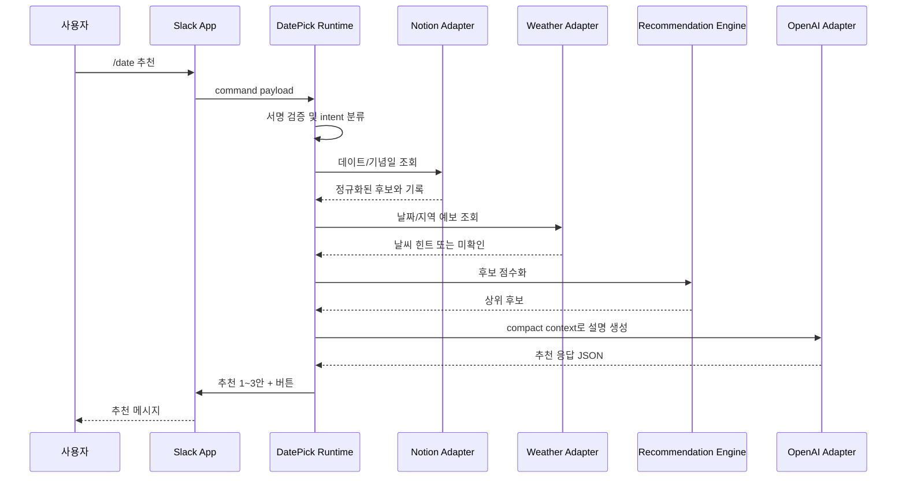
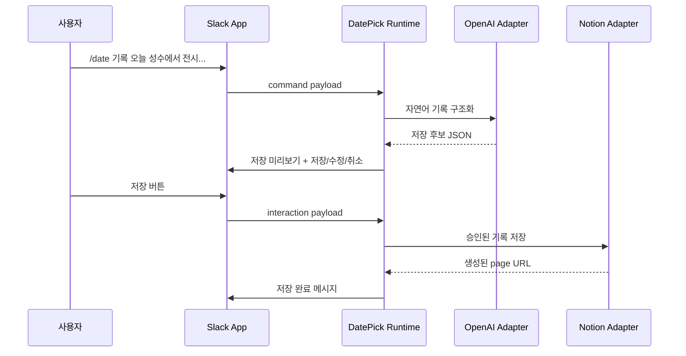
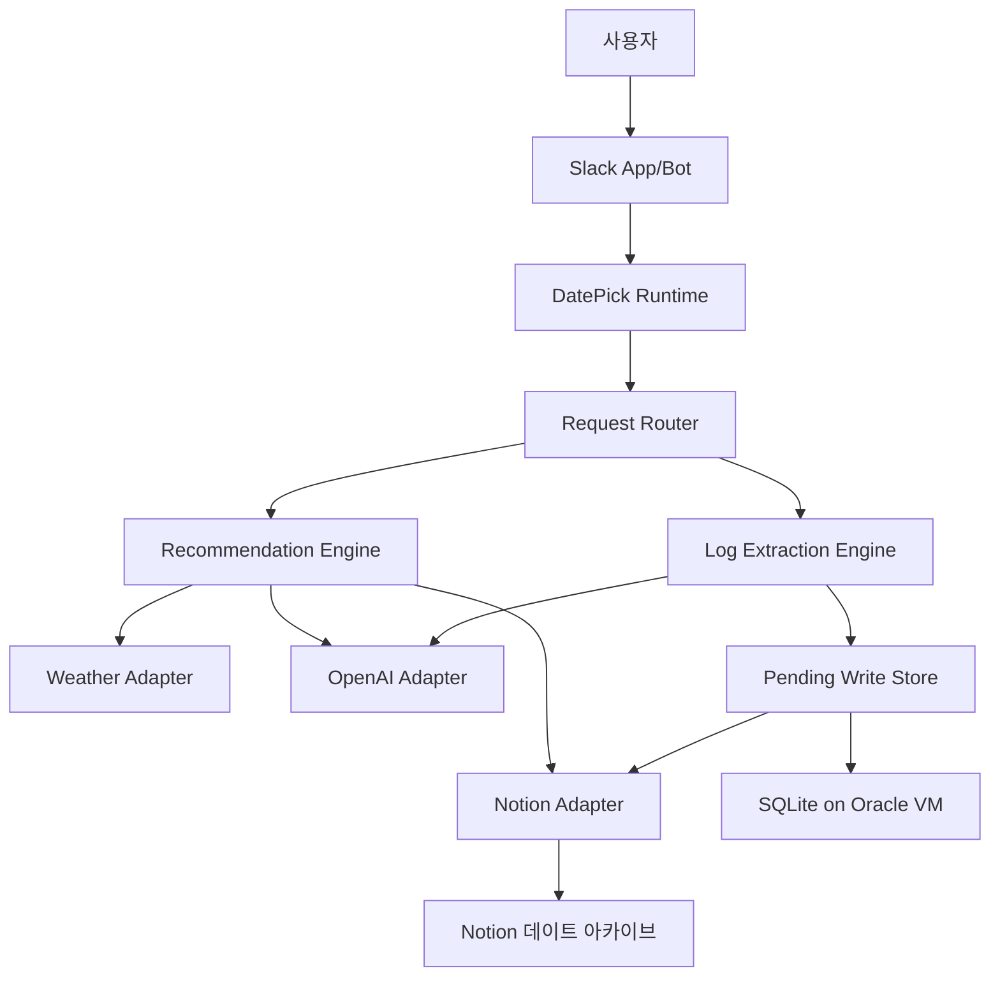

# 데이트봇 MVP 아키텍처

## 요약

데이트봇 MVP는 일반 Slack App/Bot을 사용자 인터페이스로 사용하고, 별도 애플리케이션 런타임에서 Notion `데이트 아카이브`와 OpenAI API를 조합해 추천과 기록 구조화를 수행한다.

MVP는 서버 고정비를 줄이면서도 상시 응답성을 확보하기 위해 Oracle Cloud Always Free VM을 기본 실행 환경으로 둔다. Slack과 Notion, OpenAI 연동 코드는 실행 위치에 종속되지 않게 분리해 로컬 PC 또는 다른 무료/저비용 클라우드로도 옮길 수 있게 한다.

## 요구사항 연결

- Slack에서 데이트 추천과 기록 요청을 받는다.
- Notion `데이트 아카이브`를 지식베이스와 저장소로 사용한다.
- OpenAI API로 추천 문장 생성, 후보 비교, 자연어 기록 구조화를 수행한다.
- Notion 쓰기 작업은 사용자 승인 후 실행한다.
- API 키와 토큰은 코드에 하드코딩하지 않는다.
- Oracle Cloud Always Free VM에서 봇 프로세스를 상시 실행한다.
- 로컬 PC 실행은 개발 및 장애 시 대안 실행 방식으로만 둔다.

## 구성 요소

### Slack Interface

Slack App/Bot 요청을 받는 경계다.

- Slash command 또는 app mention 요청 수신
- Slack signing secret 검증
- 추천/기록 intent 추출을 위한 원문 전달
- 추천 결과 메시지 전송
- 저장, 수정, 취소 버튼 interaction 처리

MVP에서는 slash command를 우선한다. Slack 연결은 Socket Mode를 기본값으로 사용해 공개 HTTPS endpoint 없이 Oracle VM에서 Slack 요청과 interaction을 받을 수 있게 한다.

### Application Runtime

데이트봇의 중심 애플리케이션이다.

- 요청 라우팅
- 사용자별 작업 context 구성
- 추천 workflow 실행
- 기록 workflow 실행
- Notion 쓰기 승인 상태 관리
- 외부 adapter 호출 조정

초기 구현에서는 단일 프로세스 구조로 충분하다. 모듈 경계만 분리하고 별도 서비스로 나누지 않는다.

### Deployment Runtime

봇 프로세스가 실행되는 배포 경계다.

- 기본 실행 환경: Oracle Cloud Always Free VM
- 기본 Slack 연결: Socket Mode
- process manager: systemd 또는 동등한 프로세스 관리자
- secret 주입: VM 환경 변수 또는 배포용 `.env`
- 애플리케이션 임시 저장소: SQLite 파일

Oracle Autonomous Database는 MVP에서 사용하지 않는다. 장기 기록과 지식베이스는 Notion이 담당하고, 애플리케이션에는 저장 승인 대기 상태와 최소 운영 상태만 필요하기 때문이다.

### Notion Adapter

Notion `데이트 아카이브`를 읽고 쓰는 경계다.

- `데이트` data source 조회
- `기념일` data source 조회
- 추천 후보 생성을 위한 정규화
- 승인된 기록 또는 후보 page 생성
- Notion property schema와 내부 도메인 모델 간 mapping

Notion API schema는 구현 시 환경 설정 또는 schema mapping 파일로 고정한다. Notion property 이름이 한국어이므로 adapter 밖에서는 영어 도메인 필드로 변환해 사용한다.

### Recommendation Engine

추천 후보를 만들고 순위를 정하는 모듈이다.

- Notion 후보와 완료 기록 분리
- 최근 완료 항목과 같은 분류 감점
- 기념일과 날짜 조건 반영
- 날씨 조건 반영
- 예상 비용과 우선순위 반영
- OpenAI API에 전달할 compact context 생성

추천 점수화는 규칙 기반으로 먼저 수행하고, OpenAI API는 최종 설명과 후보 비교를 자연스럽게 만드는 데 사용한다.

### Log Extraction Engine

자연어 데이트 기록을 Notion 저장 후보로 바꾸는 모듈이다.

- 날짜, 이름, 분류, 장소, 비용, 비고 추출
- 누락 정보 표시
- Notion 저장 미리보기 생성
- Slack 버튼 승인 후 Notion Adapter에 저장 요청 전달

### OpenAI Adapter

OpenAI API 호출 경계다.

- 추천 설명 생성
- 자연어 기록 구조화
- JSON schema 기반 응답 검증
- token 사용량 제한
- 실패 시 사용자에게 재시도 가능한 오류 메시지 반환

OpenAI 호출부는 adapter로 격리해 향후 모델 변경이나 provider 변경이 가능하게 한다.

### Weather Adapter

날씨 정보를 가져오는 경계다.

- 날짜와 지역 기준 예보 조회
- 실내/실외 추천 힌트 생성
- API 실패 시 날씨 미확인 상태 반환

MVP에서 날씨 provider는 미정이다. provider가 정해지기 전까지는 mock 또는 수동 입력으로 대체할 수 있다.

## 데이터 흐름

### 추천 요청



### 기록 저장



## 외부 연동

### Slack

- 일반 Slack App/Bot을 사용한다.
- MVP 기본 명령은 `/date`로 둔다.
- 요청 검증에는 Slack signing secret을 사용한다.
- 버튼 interaction은 저장 승인, 수정 요청, 취소를 처리한다.
- Oracle VM 실행에서는 Socket Mode를 기본으로 사용한다.
- 공개 HTTPS endpoint는 Socket Mode를 사용할 수 없거나 다른 클라우드 배포로 전환할 때만 검토한다.

### Notion

확인된 root page:

- `데이트 아카이브`: `https://www.notion.so/2f32d61b14f080fb8c1dc2fa1d620fa9`

확인된 data source:

- `데이트`: `collection://2f32d61b-14f0-8185-921a-000b1bb7565b`
- `기념일`: `collection://2f32d61b-14f0-81f1-adfc-000bc302a846`

`데이트` schema:

| Notion property | Type | Domain field |
| --- | --- | --- |
| 이름 | title | title |
| 분류 | select: 여행, 데이트, 맛집, 기념일, 계절, 기타 | category |
| 상태 | status: 시작 전, 진행 중, 완료 | status |
| 우선순위 | select: Low, Medium, High | priority |
| 언제? | date | date |
| 예상 비용 | number(won) | estimated_cost |
| 어디로? | text | location |
| 비고 | text | notes |

`기념일` schema:

| Notion property | Type | Domain field |
| --- | --- | --- |
| 이름 | title | title |
| 유형 | select: 생일, 기념일, 특별한 날 | type |
| 날짜 | date | date |
| Notes | text | notes |
| 몇 일 남았지? | formula | days_left_readonly |
| 커플 캘린더 | relation | calendar_relation |

Formula와 relation property는 MVP에서 읽기 전용으로 취급한다.

### OpenAI

- 추천 응답은 JSON 구조로 받은 뒤 Slack 표시용 문장으로 변환한다.
- 기록 구조화도 JSON 구조로 받은 뒤 Notion property에 mapping한다.
- 필요한 Notion context만 전달해 token 사용량을 줄인다.
- API 실패, timeout, JSON validation 실패는 사용자에게 재시도 가능한 메시지로 반환한다.

## 저장소와 데이터 모델

MVP는 별도 영구 DB 없이 시작한다. 장기 데이터는 Notion에 저장한다.

애플리케이션 내부 도메인 모델:

```text
DateItem
- id
- title
- category
- status
- priority
- date
- estimated_cost
- location
- notes
- source_url

Anniversary
- id
- title
- type
- date
- notes
- source_url

RecommendationCandidate
- title
- reason
- estimated_cost_min
- estimated_cost_max
- weather_fit
- novelty_reason
- confidence
- needs_user_check
- notion_source_urls

PendingWrite
- id
- user_id
- channel_id
- action
- payload
- expires_at
```

`PendingWrite`는 저장 승인 전 임시 상태다. MVP에서는 Oracle VM 로컬 SQLite에 저장해 프로세스 재시작 후에도 짧은 시간 동안 승인 대기를 유지할 수 있게 한다.

## 오류 처리와 관측성

- Slack 요청 검증 실패: 응답하지 않거나 일반 오류로 처리한다.
- Notion 조회 실패: "Notion을 읽지 못해 추천을 만들 수 없음"으로 안내한다.
- Notion 저장 실패: 미리보기 내용은 유지하고 다시 저장할 수 있게 한다.
- OpenAI 실패: 재시도 가능한 짧은 오류를 Slack에 반환한다.
- 날씨 조회 실패: 날씨 근거를 `확인 필요`로 표시하고 추천을 계속한다.
- 모든 외부 API 호출에는 timeout을 둔다.
- 로그에는 요청 ID, workflow type, 외부 호출 성공/실패, token 사용량을 남긴다.
- 로그에 Slack 원문 전체나 민감한 token을 남기지 않는다.

## 보안 고려사항

- `SLACK_BOT_TOKEN`, `SLACK_SIGNING_SECRET`, `SLACK_APP_TOKEN`, `NOTION_TOKEN`, `OPENAI_API_KEY`는 환경 변수로만 주입한다.
- Notion integration 권한은 `데이트 아카이브`와 필요한 하위 database로 제한한다.
- Slack은 DM 또는 비공개 채널 사용을 기본으로 한다.
- Notion 쓰기는 Slack 버튼 승인 후에만 수행한다.
- OpenAI에는 필요한 요약 context만 전달하고 장기 저장용 대화 원문 전체는 전달하지 않는다.
- 공개 URL이나 로그에 API token이 노출되지 않게 한다.

## 테스트와 배포

### 테스트

- Slack payload 검증 단위 테스트
- intent 분류 단위 테스트
- Notion schema mapping 단위 테스트
- 추천 점수화 단위 테스트
- OpenAI 응답 JSON validation 테스트
- 기록 구조화 결과의 Notion property mapping 테스트
- Notion/Slack/OpenAI adapter는 mock 기반 통합 테스트

### Oracle Always Free VM 실행

- Oracle Cloud Always Free VM에서 단일 프로세스로 실행한다.
- Socket Mode를 사용하면 공개 HTTPS endpoint 없이 Slack 이벤트를 받을 수 있다.
- systemd 등으로 봇 프로세스 재시작을 관리한다.
- SQLite 파일은 VM 로컬 디스크에 둔다.
- Oracle VM capacity, idle reclaim, 백업 방식은 운영 준비 단계에서 확인한다.

### 로컬 실행

- 로컬 PC 실행은 개발, 디버깅, Oracle VM 장애 시 대안으로 둔다.
- PC가 꺼지거나 절전 상태가 되면 봇이 응답하지 못한다.

### 다른 무료 또는 저비용 클라우드 실행

- Oracle VM을 사용할 수 없으면 HTTPS endpoint 또는 Socket Mode 기반의 다른 무료/저비용 클라우드를 검토한다.
- 무료 할당량, cold start, secret 관리, 로그 보존 정책을 implementation plan에서 비교한다.

## 다이어그램



## 다음 과제

- 실제 Slack/Notion/OpenAI token으로 Socket Mode smoke test를 수행한다.
- Oracle Always Free VM 생성 가능 여부와 운영 제약을 확인한다.
- 실제 운영용 OpenAI 모델과 월 예산 상한을 정한다.
- 날씨 provider를 정한다.
- Oracle VM 프로세스 자동 재시작 방식을 정한다.
